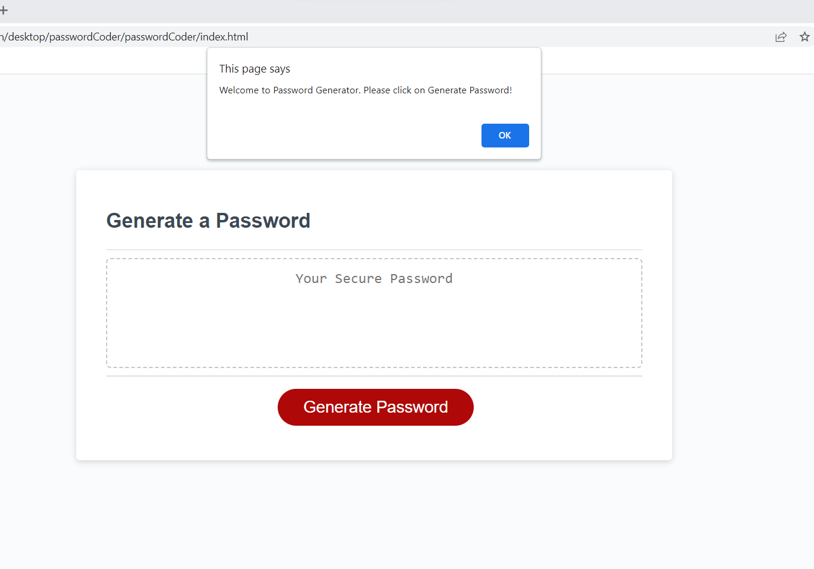

🏗️ passwordCoder   

# Description: 

For the third homework assignment, or submission, the student was given pre-written HTML and CSS code in order to code a password generator program that results in creating a random password with JavaScript.  JavaScript was the main assignment; no changes needed to be added to the HTML and CSS.  The results will publish a live site allowing the user to answer the following criteria to create the password:

1. Use of capital letters.
2. Use of lower case letters.
3. Use of numbers.
4. Use of special characters. 
5. Confirm how many characters for the password [8-128 in length]. 

# Code Contributors 

The project was completed by each student. This was completed by Paul Nixon. 

# User Story 

A pre-written HTML & CSS file were provided. The assignment is to create a randon password generator.  

# Acceptance Criteria 

The assignment is complete when all aspects of the UPENN Module #3 Acceptance Criteria points are met.

# Assets
N/A

Below is an example image of the final project:

URL to Deployed Project Site:

Below is an image example of the final project:

